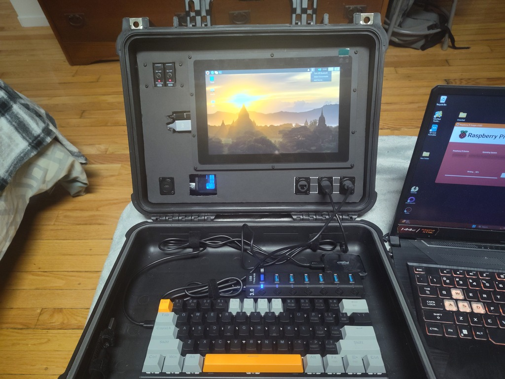

<!-- ======================================== README.md Start ======================================== -->

<!-- ------------------------------ Intro Start ------------------------------ -->

# Y.A.A.C

<!-- ------------------------------ Intro End ------------------------------ -->

<!-- ------------------------------ Overview Start ------------------------------ -->

## Overview

The Y.A.A.C (Yet Another Apache CyberDeck/Yak) is my personal take on a [CyberDecks](https://www.reddit.com/r/CyberDeck/).  It is a planned family of CyberDecks for various uses.  Currently working the [Y.A.A.C1](/doc/yaac1/index.md), a general use CyberDeck, including general computing, cyber security, and offline internet.

Future planned decks include the [Y.A.A.Cg](/doc/yaacg/index.md) for Gaming, the [Y.A.A.Cp](/doc/yaacp/index.md) for a portable power supply, and the [Y.A.A.Cm](/doc/yaacm/index.md) a miniture deck.

This repository details my build process, as well as containing links to components, software, inspiration and other useful information.

Version 0.1.0 of the Y.A.A.C.1

<!-- ------------------------------ Overview End ------------------------------ -->

<!-- ------------------------------ Files Start ------------------------------ -->

## Files

* [Build Guide](doc/build.md) A step by step reference of the build process
* [Components](doc/components.md) A list of compents used, components owned, and components to possibly buy
* [Contents](doc/content,md) Content included and planned to be included
* [Guides](doc/guides.md) A list of guides/tutorials/information
* [Inspiration](doc/inspiration.md) Other CyberDecks, projects, and links for inspiration
* [Projects](doc/projects.md) A list of built and planned projects
* [Setup](doc/setup.md) Setup steps for the operating systems and software
* [Specifications](doc/specs.md) Hardware specifications
* [Software](doc/software.md) Software used and to possibly use
* [To Do List](doc/todo.md) To Do list
* [Unsorted](doc/unsorted.md) A file containing links and other information yet to be sorted

<!-- ------------------------------ Files End ------------------------------ -->

<!-- ------------------------------ Outro Start ------------------------------ -->

<!-- ------------------------------ Outro End ------------------------------ -->

<!-- ================================================================================ -->
