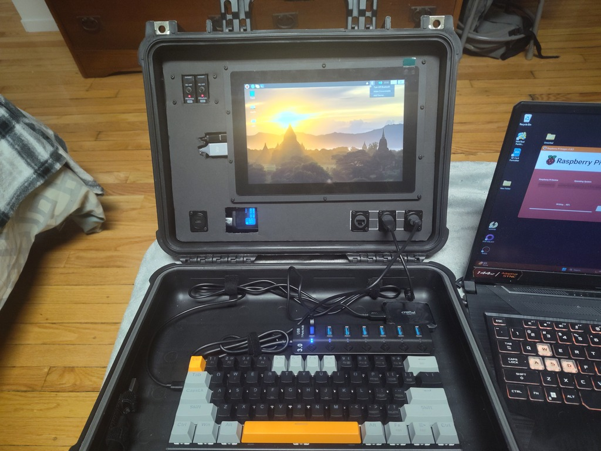

<!-- ======================================== README.md Start ======================================== -->

<!-- ------------------------------ Intro Start ------------------------------ -->

<!-- ------------------------------ Intro End ------------------------------ -->

<!-- ------------------------------ Overview Start ------------------------------ -->

## Overview

The Y.A.A.Cs (Yet Another Apache CyberDeck/Yak) are my personal take on [CyberDecks](https://www.reddit.com/r/CyberDeck/).  They are a planned family of CyberDecks for various uses.

Currently working the [Y.A.A.C-1](/doc/yaac1/index.md), a general use CyberDeck, including general computing, cyber security, and offline internet.  At it's core is a Raspberry Pi 4 in an Apache 3800 case.  Powered by an Anker powerbank and a Geekworm UPS.

This repository details my build process, as well as containing links to components, software, inspiration and other useful information.

Version 0.1.0 of the Y.A.A.C.1

<!-- ------------------------------ Overview End ------------------------------ -->

<!-- ------------------------------ Files Start ------------------------------ -->

## Files

- [Components](doc/components.md) A list of compents I own, as well as components that may be useful for future builds
- [Guides](doc/guides.md) A list of guides/tutorials/information
- [Inspiration](doc/inspiration.md) Other CyberDecks, projects, and links for inspiration
- [Software](doc/software.md) Software used and to possibly use
- [To Do List](doc/todo.md) To Do list
- [Unsorted](doc/unsorted.md) A file containing links and other information yet to be sorted

<!-- ------------------------------ Files End ------------------------------ -->

<!-- ------------------------------ Decks Start ------------------------------ -->

## Decks
- [Y.A.A.C-1](doc/yaac1/index.md): Y.A.A.C-1 is the primary CyberDeck.  This deck build is currently in process.
- [Y.A.A.C-g](doc/yaacg/index.md): A deck designed for gaming.  A future deck still in planning stages.
- [Y.A.A.C-p](doc/yaacp/index.md): A portable power supply.  A future deck still in planning stages.

<!-- ------------------------------ Decks End ------------------------------ -->

<!-- ------------------------------ Outro Start ------------------------------ -->

<!-- ------------------------------ Outro End ------------------------------ -->

<!-- ======================================== README.md End ======================================== -->
