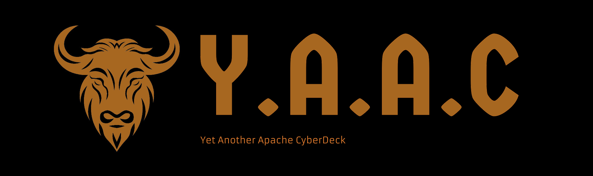

<!-- ================================================================================ -->

# Y.A.A.C

## Overview

The Y.A.A.C (Yet Another Apache CyberDeck/Yak) is my personal take on a CyberDeck.  It is designed for multiple uses, including general computing, cyber security, and offline internet.  This repository details my build process, as well as containing links to components, software, inspiration and other useful information.

## Files

* [Components](doc/components.md) A list of compents used in the Y.A.A.C, components owned, and components to possibly buy.
* [Contents](doc/content,md) Content included and planned to be included on the Y.A.A.C.
* [Guides](doc/guides.md) A list of guides/tutorials/information.
* [Inspiration](doc/inspiration.md) Other CyberDecks and links for inspiration.
* [Setup](doc/setup.md) Setup steps for the operating systems and software.
* [Software](doc/software.md) Software used and to possibly use on the Y.A.A.C.
* [To Do List](doc/todo.md) To Do list for the Y.A.A.C.
* [Unsorted](doc/unsorted.md) A file containing links and other information yet to be sorted.

<!-- ================================================================================ -->
