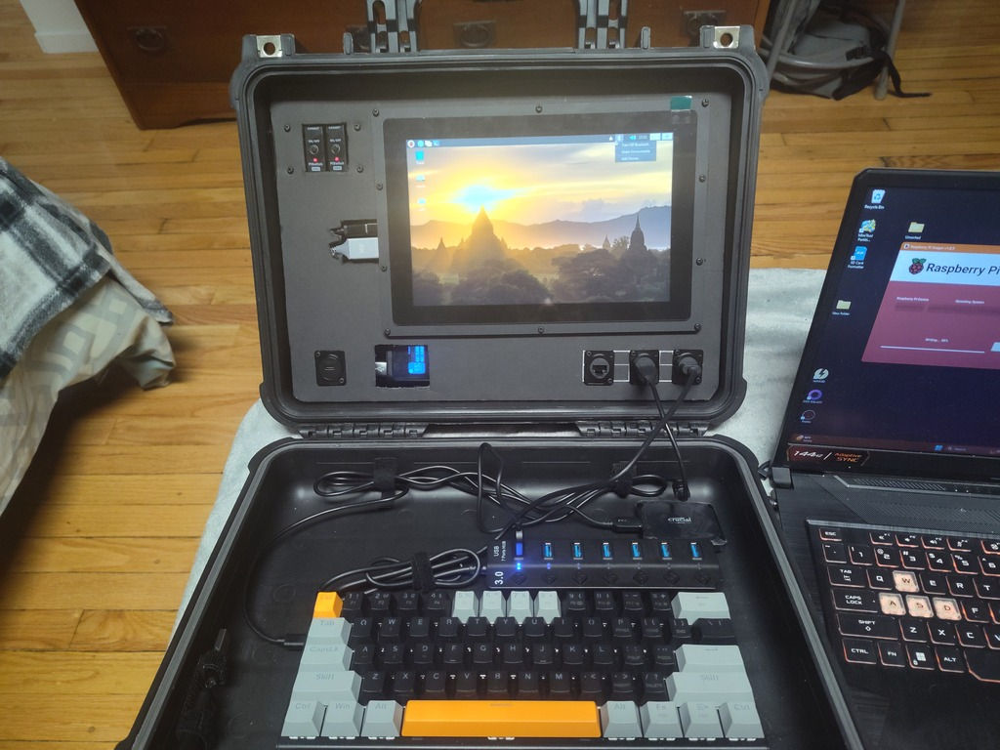

<!-- ======================================== index.md Start ======================================== -->

<!-- ------------------------------ Intro Start ------------------------------ -->

# Y.A.A.C-1

This page is the home of the Y.A.A.C-1, my primary CyberDeck.

<!-- ------------------------------ Intro End ------------------------------ -->

<!-- ------------------------------ Overview Start ------------------------------ -->

## Overview

The Y.A.A.C-1 is a general use CyberDeck, for general computing, cyber security, and offline internet. At it's core is a Raspberry Pi 4 in an Apache 3800 case. Powered by an Anker powerbank and a Geekworm UPS.
This repository details my build process, as well as containing links to components, software, inspiration and other useful information.

Version 0.1.0 of the Y.A.A.C-1

<!-- ------------------------------ Overview End ------------------------------ -->

<!-- ------------------------------ Files Start ------------------------------ -->

## Files

* [Build Guide](yaac1-build.md) A step by step reference of the build process
* [Components](yaac1-components.md) A list of compents used, components owned, and components to possibly buy
* [Contents](yaac1-content.md) Content included and planned to be included
* [Setup](yaac1-setup.md) Setup steps for the operating systems and software
* [Specifications](yaac1-specs.md) Hardware specifications
* [Software](yaac1-software.md) Software used and to possibly use
* [To Do List](yaac1-todo.md) To Do list

<!-- ------------------------------ Files End ------------------------------ -->

<!-- ------------------------------ Outro Start ------------------------------ -->

<!-- ------------------------------ Outro End ------------------------------ -->

<!-- ======================================== index.md End ======================================== -->
